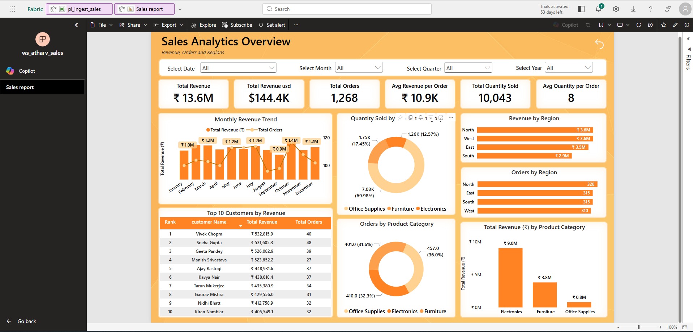

# ⚡ Sales Analytics — End-to-End Microsoft Fabric Pipeline

A complete data pipeline built on **Microsoft Fabric**, implementing the Medallion Architecture (Bronze → Silver → Gold) to transform raw sales data into a star-schema data warehouse, powering an interactive Power BI report.

---

## 📊 Final Report Preview



---

## 🎯 Project Objective

To build a production-style analytics pipeline — not just a dashboard — that demonstrates the full journey data takes in a modern analytics platform:

**Raw CSV → Ingestion → Cleaning → Dimensional Modeling → Warehouse → Business Intelligence Report**

This project was built to understand how data engineering, analytics engineering, and BI reporting connect as one system, rather than treating each stage as an isolated exercise.

---

## 🏗️ Architecture Overview

```
┌──────────────┐   ┌──────────────┐   ┌──────────────────┐   ┌──────────────────┐   ┌──────────────────┐
│  Raw Sales   │──▶│  Copy Data   │──▶│  Bronze Layer     │──▶│  Silver Layer     │──▶│  Gold Layer       │
│  CSV         │   │  Activity    │   │  (Delta, raw)     │   │  (Cleaned)        │   │  (Star Schema)    │
└──────────────┘   └──────────────┘   └──────────────────┘   └──────────────────┘   └──────────────────┘
                                                                                                │
                                                                                                ▼
                                                                                      ┌──────────────────┐
                                                                                      │  Fabric Warehouse │
                                                                                      │  (fact + dims)    │
                                                                                      └──────────────────┘
                                                                                                │
                                                                                                ▼
                                                                                      ┌──────────────────┐
                                                                                      │  Power BI Report  │
                                                                                      │  (Semantic Model) │
                                                                                      └──────────────────┘
```

The entire flow is orchestrated by a single **Data Factory pipeline** (`pl_ingest_sales`) inside Fabric, chaining 5 activities: raw ingestion → transformation notebooks (×3) → final load into the warehouse.

---

## 🔧 Technical Walkthrough

### Step 1 — Fabric Warehouse: Initial Setup (T-SQL, via SQL analytics endpoint)

Before any dimensional modeling happens, the Warehouse is organized into three purpose-built schemas rather than one flat namespace:

```sql
CREATE SCHEMA staging;   -- Raw loads from the Lakehouse
CREATE SCHEMA analytics; -- Cleaned views, dimension/fact tables, aggregations
CREATE SCHEMA reporting; -- Final Power BI-facing objects
```

**A basic data check** confirms the `silver_sales` data lands correctly in staging before any modeling begins:

```sql
SELECT TOP 5 * FROM staging.silver_sales ORDER BY order_date DESC;
```

**An ad-hoc regional summary** validates the raw numbers look reasonable early on:

```sql
SELECT
    region,
    SUM(revenue) AS total_revenue,
    COUNT(order_id) AS total_orders,
    ROUND(AVG(revenue), 2) AS avg_order_value
FROM staging.silver_sales
GROUP BY region
ORDER BY total_revenue DESC;
```

**A reusable view** then formalizes that region-level aggregation with a monthly breakdown, decoupling the report layer from the raw fact table:

```sql
CREATE VIEW analytics.vw_sales_by_region AS
SELECT
    region,
    FORMAT(order_date, 'yyyy-MM') AS year_month,
    SUM(revenue) AS total_revenue,
    COUNT(order_id) AS total_orders,
    AVG(revenue) AS avg_order_value
FROM staging.silver_sales
GROUP BY region, FORMAT(order_date, 'yyyy-MM');
```

**A parameterized stored procedure** returns the top N customers by revenue, avoiding a hardcoded query for every "Top 10" request:

```sql
CREATE PROCEDURE analytics.usp_GetTopCustomers
    @TopN INT = 10
AS
BEGIN
    SELECT TOP (@TopN)
        customer_name,
        SUM(revenue) AS total_revenue,
        COUNT(order_id) AS total_orders
    FROM staging.silver_sales
    GROUP BY customer_name
    ORDER BY total_revenue DESC;
END;

EXEC analytics.usp_GetTopCustomers;          -- default top 10
EXEC analytics.usp_GetTopCustomers @TopN = 5; -- custom top 5
```

This same stored procedure powers the "Top 10 Customers by Revenue" table in the final Power BI report.

**Finally, `dim_date` is built directly in the Warehouse** using `GENERATE_SERIES`, spanning a full 731-day range rather than being derived from the source data — completing the warehouse setup before any Lakehouse-side dimensional tables exist:

```sql
CREATE TABLE analytics.dim_date (
    order_date_key INT         NOT NULL,
    full_date      DATE        NOT NULL,
    year           INT         NOT NULL,
    month_number   INT         NOT NULL,
    month_name     VARCHAR(20) NOT NULL,
    quarter        INT         NOT NULL,
    day_of_week    VARCHAR(20) NOT NULL,
    is_weekend     BIT         NOT NULL
);

INSERT INTO analytics.dim_date
SELECT
    CAST(FORMAT(dt, 'yyyyMMdd') AS INT) AS order_date_key,
    dt AS full_date,
    YEAR(dt) AS year,
    MONTH(dt) AS month_number,
    DATENAME(MONTH, dt) AS month_name,
    DATEPART(QUARTER, dt) AS quarter,
    DATENAME(WEEKDAY, dt) AS day_of_week,
    CASE WHEN DATEPART(WEEKDAY, dt) IN (1, 7) THEN 1 ELSE 0 END AS is_weekend
FROM (
    SELECT DATEADD(DAY, CAST(value AS INT), CAST('2023-01-01' AS DATE)) AS dt
    FROM GENERATE_SERIES(0, 730)
) AS dates;
```

This ensures every calendar date has a row — including dates with zero sales — which matters for accurate time-intelligence in Power BI (e.g. correctly showing a $0 revenue day rather than a missing one). Building `dim_date` in the Warehouse first, ahead of the Lakehouse dimensional tables, means the date dimension is ready to receive fact-table joins as soon as `fact_sales` is promoted later.

---

### Step 2 — Gold Layer: Building the Star Schema in the Lakehouse (PySpark)

With the Warehouse structure already in place, `nb_build_tables.ipynb` reads the cleaned `silver_sales` Delta table (1,268 rows) and builds four Gold-layer tables in the Lakehouse using surrogate keys generated via `monotonically_increasing_id()`.

**Dimension tables** — each built by extracting distinct values and assigning a surrogate key:

```python
# dim_customer — 93 unique customers
dim_customer = df.select('customer_name', 'region') \
    .distinct() \
    .withColumn('customer_key', monotonically_increasing_id() + 1) \
    .select('customer_key', 'customer_name', 'region')

dim_customer.write.format('delta').mode('overwrite').saveAsTable('dim_customer')
```

The same pattern is repeated for `dim_product` (3 categories: Electronics, Furniture, Office Supplies) and `dim_region` (4 regions: North, South, East, West).

**Fact table** — built by joining `silver_sales` back to each dimension to resolve surrogate keys, plus a generated date key that aligns with the `order_date_key` format already established in the Warehouse's `dim_date`:

```python
fact = df_silver \
    .join(df_customer, ['customer_name', 'region'], 'left') \
    .join(df_product, 'product_category', 'left') \
    .join(df_region, 'region', 'left') \
    .withColumn('order_date_key',
        date_format(to_date(col('order_date'), 'yyyy-MM-dd'), 'yyyyMMdd').cast('int'))

fact_sales = fact.select(
    'order_id', 'order_date_key', 'customer_key', 'product_key',
    'region_key', 'revenue', 'quantity', 'revenue_usd'
)
```

Result: `fact_sales` with 1,268 rows, each linking to its customer, product, region, and date via integer surrogate keys — a proper star schema rather than a flattened table.

---

### Step 3 — Promoting the Gold-Layer Star Schema into the Warehouse

With the Warehouse structure fully set up (Step 1) and the star schema built in the Lakehouse (Step 2), the final step promotes `dim_customer`, `dim_product`, `dim_region`, and `fact_sales` into the Warehouse's `analytics` schema, where `dim_date` is already waiting:

```sql
CREATE TABLE analytics.dim_customer AS SELECT * FROM lh_sales.dbo.dim_customer;
CREATE TABLE analytics.dim_product  AS SELECT * FROM lh_sales.dbo.dim_product;
CREATE TABLE analytics.dim_region   AS SELECT * FROM lh_sales.dbo.dim_region;
CREATE TABLE analytics.fact_sales   AS SELECT * FROM lh_sales.dbo.fact_sales;
```

This completes the full analytics schema — `dim_date`, `dim_customer`, `dim_product`, `dim_region`, and `fact_sales` all sitting together in the Warehouse, ready to power the Power BI semantic model.

---

## 📁 Repository Structure

```
📂 Sales-Analytics-Microsoft-Fabric-Pipeline/
├── 📂 notebooks/
│   └── nb_build_tables.ipynb      ← PySpark: builds dim_customer, dim_product, dim_region, fact_sales
├── 📂 sql/
│   └── warehouse_setup.sql        ← T-SQL: schemas, views, stored procedures, dim_date generation
├── 📂 screenshots/
│   ├── 01_workspace_overview.png
│   ├── 02_pipeline_flow.png
│   ├── 03_lakehouse_tables.png
│   ├── 04_powerbi_report.png
│   └── 05_warehouse_tables.png
├── Sales_report.pbix
├── sales_data.csv
└── README.md
```

---

## 📁 Fabric Workspace Structure

| Item | Type | Purpose |
|---|---|---|
| `lh_sales` | Lakehouse | Stores Bronze, Silver, and Gold layer Delta tables |
| `lh_reporting` | Lakehouse | Supporting reporting layer |
| `nb_load_to_delta` | Notebook | Ingests raw CSV into Bronze Delta format |
| `nb_transform_bronze_to_silver` | Notebook | Cleans and standardizes Bronze data into Silver |
| `nb_build_gold_layer` | Notebook | Builds dimensional (star schema) Gold tables from Silver |
| `nb_build_tables` | Notebook | Supporting table creation logic |
| `pl_ingest_sales` | Data Pipeline | Orchestrates the full Bronze → Silver → Gold → Warehouse flow |
| `Sales_Dataflow` | Dataflow Gen2 | Additional data preparation/transformation |
| `wh_sales` | Warehouse | Final star-schema warehouse — `fact_sales`, `dim_customer`, `dim_product`, `dim_region`, `dim_date` |
| `Sales_Semantic` | Semantic Model | Powers the Power BI report from the warehouse |
| `Sales report` | Power BI Report | Final interactive business-facing dashboard |

---

## 🗄️ Dataset

**Source:** `sales_data.csv` — order-level sales transaction data

| Detail | Info |
|---|---|
| Rows | 1,525 orders |
| Columns | OrderID, OrderDate, CustomerName, Region, ProductCategory, Revenue, Quantity, Status |
| Status values | Active, Cancelled, Returned |
| Regions | North, South, East, West |
| Categories | Electronics, Furniture, Office Supplies |

This raw file is the single source ingested at the start of the pipeline — all downstream Bronze, Silver, Gold, and Warehouse tables are derived from it.

---

## 🔑 Key Findings (from the final report)

1. **Total revenue of ₹13.6M** across 1,268 orders, with an average revenue per order of ₹10.9K.
2. **Electronics is the dominant revenue driver** at ₹9.0M — more than double Furniture (₹3.8M) and over 10× Office Supplies (₹0.8M) — despite Office Supplies having the highest order count (36% of orders).
3. **Revenue is well-balanced across regions**, with North, West, and East each contributing roughly ₹3.5-3.6M, and South slightly behind at ₹2.9M.
4. **A small number of repeat customers drive disproportionate revenue** — the top 10 customers by revenue each generated ₹400K+ across 27-48 orders, highlighting a clear high-value customer segment worth targeted retention efforts.
5. **Monthly revenue shows clear volatility**, with a dip around September before recovering into Q4 — worth further investigation into seasonal ordering patterns or a specific business event.

---

## 🛠️ Skills Demonstrated

| Category | Skill |
|---|---|
| Data ingestion | Pipeline-orchestrated Copy Data activity from raw CSV into Lakehouse |
| Data engineering | Medallion Architecture (Bronze/Silver/Gold) using PySpark notebooks in Fabric |
| Data modeling | Star schema design — surrogate key generation via `monotonically_increasing_id()`, fact-to-dimension joins to resolve keys |
| Pipeline orchestration | Multi-activity Fabric Data Factory pipeline with sequential dependencies |
| Data warehousing | Fabric Warehouse organized into `staging`, `analytics`, and `reporting` schemas — separating raw, modeled, and report-facing layers |
| Date dimension engineering | Generated a complete `dim_date` table using T-SQL `GENERATE_SERIES`, ensuring every calendar date exists regardless of sales activity |
| SQL views & stored procedures | Built a reusable region/month aggregation view and a parameterized `usp_GetTopCustomers` stored procedure to avoid hardcoded reporting queries |
| Semantic modeling | Power BI semantic model built directly on the warehouse |
| Data visualization | Combo charts, donut charts, KPI cards, ranked tables, multi-level date filtering (Date/Month/Quarter/Year) |
| Platform | Microsoft Fabric (unified Lakehouse, Data Factory, Warehouse, and Power BI in one platform) |

---

## 🚀 How to Reproduce This Project

1. Create a Microsoft Fabric workspace (free trial available via Power BI / Fabric)
2. Create a Lakehouse named `lh_sales`
3. Upload `sales_data.csv` to the Lakehouse Files section
4. Run the Bronze and Silver transformation notebooks (ingest raw data, clean and standardize into `silver_sales`)
5. Create a Warehouse (`wh_sales`) and, via its SQL analytics endpoint, run `sql/warehouse_setup.sql` **up to and including `dim_date`**:
   - Create the `staging`, `analytics`, and `reporting` schemas
   - Run the basic data check and ad-hoc regional summary against `staging.silver_sales`
   - Create the `vw_sales_by_region` view and the `usp_GetTopCustomers` stored procedure
   - Create and populate `analytics.dim_date` via `GENERATE_SERIES`
6. Run `notebooks/nb_build_tables.ipynb` to build the Gold-layer star schema (`dim_customer`, `dim_product`, `dim_region`, `fact_sales`) in the Lakehouse
7. Back in the Warehouse, run the remaining queries in `sql/warehouse_setup.sql` to promote `dim_customer`, `dim_product`, `dim_region`, and `fact_sales` from the Lakehouse into the `analytics` schema
8. Orchestrate steps 4–7 into a Data Factory pipeline (`pl_ingest_sales`) for repeatable, automated runs
9. Open `Sales_report.pbix` in Power BI Desktop, or connect a new report to the `Sales_Semantic` model

---

## 💡 What I Learned

- How to design and implement the Medallion Architecture pattern — separating raw ingestion (Bronze), cleaned data (Silver), and business-ready dimensional models (Gold) into distinct, auditable stages rather than doing all transformation in one step.
- How to build a proper star schema with fact and dimension tables, rather than a single flattened table — enabling cleaner relationships and more efficient Power BI report performance.
- Why `dim_customer` needed a composite join key (`customer_name` + `region`) rather than name alone — since customer names weren't guaranteed unique across regions in the source data, joining on name only would have silently produced incorrect fact-to-dimension matches.
- How to structure a data warehouse into purpose-specific schemas (`staging`, `analytics`, `reporting`) rather than one flat namespace — making it clear which layer is raw, which is modeled, and which is safe for direct BI consumption.
- Why generating `dim_date` independently (via `GENERATE_SERIES`) in the Warehouse first — before the Lakehouse dimensional tables even existed — guarantees a complete, gap-free calendar ready to receive fact-table joins, rather than deriving it only from dates present in the sales data.
- How a parameterized stored procedure (`usp_GetTopCustomers`) avoids duplicating near-identical queries for different "Top N" requests, and can be called directly from a Power BI report parameter.
- How to orchestrate a multi-step pipeline with dependent activities in Fabric's Data Factory, chaining data movement and transformation notebooks into one automated flow.
- The practical difference between working directly on a Lakehouse (flexible, file-based, Spark-native) versus a Warehouse (structured, T-SQL-native, optimized for BI consumption) — and why a Gold-to-Warehouse handoff makes sense architecturally.
- How Power BI's semantic model layer decouples the report from the underlying warehouse structure, making the report easier to maintain as the data model evolves.

---

## 🙋 About

Built by **[Your Name]** as part of a data analyst portfolio project.

- 🔗 LinkedIn: [your-linkedin-url]
- 📧 Email: your@email.com

---

*If you found this useful, please ⭐ star the repository!*
